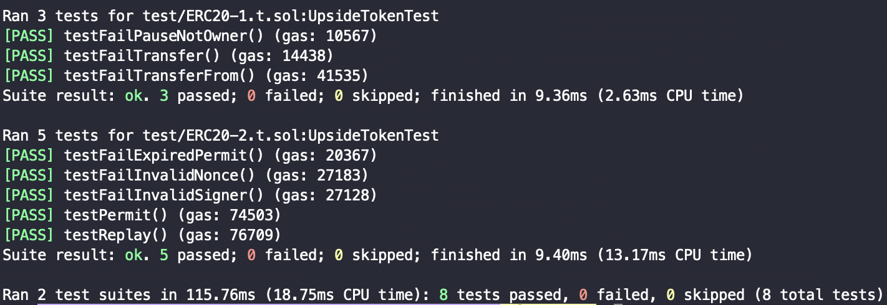

## 주어진 interface 및 test code 분석

### ERC20-1.t.sol

- setUp
    
    이름이 UPSIDE, 심볼이 UPS인 토큰 생성, alice와 bob에게 각각 50 ether 송금
    
- testFailPauseNotOwner
    
    alice(토큰의 owner가 아님)가 pause함수 실행 못하는지 확인
    
- testFailTransfer
    
    pause 후 alice가 bob에게 송금 못하는지 확인
    
- testFailTransferFrom
    
    pause 후 alice가 msg.sender에 대한 approve 후 alice → bob으로 transferFrom을 못하는지 확인
    

### ERC20-2.t.sol

- setUp
    
    alice, bob의 PK로 주소 생성, 이름이 UPSIDE, 심볼이 UPS인 토큰 생성, alice와 bob에게 각각 50 ether 송금
    

- testPermit
    
    permit을 한 뒤, allowance와 nonces가 제대로 update되었는지 확인
    

- testFailExpiredPermit
    
    기한을 1일로 한 sign을 생성한 경우, 1일보다 더 뒤에 permit을 하지 못하는 것을 확인
    
- testFailInvalidSigner
    
    alice에 대한 서명을 bobPK로 한 경우, signer가 invalid한지 확인
    
- testFailInvalidNonce
    
    잘못된 nonce를 보냈을 때, revert가 나는지 확인
    
- testReplay
    
    같은 sign을 2번 보내는 것이 불가능한지 확인
    

## 구현

### 전역변수, modifier, event

```solidity
string private _name;
string private _symbol;
bool public _pause;
address private _owner;
uint256 private _totalSupply;
bytes32 public constant PERMIT_TYPEHASH = keccak256("Permit(address owner,address spender,uint256 value,uint256 nonce,uint256 deadline)");
string private version;

mapping(address => mapping(address => uint256)) public allowance; // _allowance[owner][spender]
mapping(address => uint256) private _balances;
mapping(address => uint256) public nonces;

modifier checkpaused() {
    require(!_pause, "not allowed while paused");
    _;
}

event Transfer(address from, address to, uint256 value);
event Approval(address from, address to, uint256 value);
```

- _name - 토큰 이름
- _symbol - 토큰 심볼
- _pause - pause상태
- _owner - 토큰의 owner
- _totalSupply - 토큰 총 발행량
- PERMIT_TYPEHASH - structhash를 만들 때 사용
- version - 컨트랙트 버전
- allowance - sender가 owner로부터 withdraw할 수 있는 금액에 대한 매핑
- _balances - address들의 금액 저장
- nonces - address들의 nonce 저장
- checkpaused - _pause상태가 아닌 경우에만 통과
- Transfer - transfer함수 호출시 반드시 실행
- Approval - approve함수 호출시 반드시 실행

### transfer

```solidity
function transfer(address _to, uint256 _value) public checkpaused returns (bool success) {
    _transfer(msg.sender, _to, _value);
    emit Transfer(msg.sender, _to, _value);
    success = true;
}

function _transfer(address _from, address _to, uint256 _value) public {
    require(_balances[_from] >= _value, "you don't have enough token");

    _balances[_from] -= _value;
    _balances[_to] += _value;
}
```

- msg.sender의 balance가 value이상인지 확인 후 to에게 송금
- Transfer event trigger

### transferFrom

```solidity
function transferFrom(address _from, address _to, uint256 _value) public returns (bool success) {
    spendallowance(_from, _to, _value);
    _transfer(_from, _to, _value);
    emit Transfer(_from, _to, _value);
    success = true;
}

function spendallowance(address owner, address spender, uint256 _value) public {
    require(allowance[owner][spender] >= _value, "no enough allowance");

    allowance[owner][spender] -= _value;
}
```

- spender, owner에 대한 allowance가 value이상인지 확인 후 from에서 to로 value만큼 송금
- Transfer event trigger

### pause, unpause

```solidity
function pause() public {
    require(msg.sender==_owner, "no permission");
    _pause = true;
}

function unpause() public {
    require(msg.sender==_owner, "no permission");
    _pause = false;
}
```

- owner만이 수행할 권한 있음
- pause상태 변화

### approve

```solidity
function approve(address spender, uint256 value) public {
    address owner = msg.sender;
    require(owner != address(0) && spender != address(0), "address 0 not allowed");

    allowance[owner][spender] = value;
    emit Approval(owner, spender, value);
}
```

- msg.sender가 spender에 대한 allowance를 value로 설정
- Approval event trigger

### _toTypedDataHash

```solidity
// https://github.com/OpenZeppelin/openzeppelin-contracts/blob/master/contracts/utils/cryptography/EIP712.sol
function _buildDomainSeparator() private view returns (bytes32) {
    bytes32 _hashedName = keccak256(bytes(_name));
    bytes32 _hashedVersion = keccak256(bytes(version));
    bytes32 TYPE_HASH = keccak256("EIP712Domain(string name,string version,uint256 chainId,address verifyingContract)");

    return keccak256(abi.encode(TYPE_HASH, _hashedName, _hashedVersion, block.chainid, address(this)));
} 

// https://github.com/OpenZeppelin/openzeppelin-contracts/blob/master/contracts/utils/cryptography/MessageHashUtils.sol
function _toTypedDataHash(bytes32 structHash) public view returns (bytes32 digest) {
    digest = keccak256(abi.encodePacked(hex"19_01", _buildDomainSeparator(), structHash));
}
```

- 컨트랙트마다 unique하여 replay attack을 막는 역할을 하는 domain separator와 structhash를 prefix와 함께 해시 (EIP-721 typed data)

### permit

```solidity
// https://github.com/OpenZeppelin/openzeppelin-contracts/blob/master/contracts/token/ERC20/extensions/ERC20Permit.sol
function permit(
    address owner,
    address spender,
    uint256 value,
    uint256 deadline,
    uint8 v,
    bytes32 r,
    bytes32 s
) public {
    require(block.timestamp < deadline, "permit deadline has expired");

    bytes32 structHash = keccak256(abi.encode(PERMIT_TYPEHASH, owner, spender, value, nonces[owner], deadline));
    bytes32 hash = _toTypedDataHash(structHash);
    address signer = ecrecover(hash, v, r, s);
    require(signer == owner, "INVALID_SIGNER");

    allowance[owner][spender] = value;

    // https://github.com/OpenZeppelin/openzeppelin-contracts/blob/master/contracts/utils/Nonces.sol
    nonces[owner]++; // _useNonce
}
```

- msg.sender 대신 signed message를 활용하여 allowance를 수정할 수 있게 해줌
- signed message는 improved user experience를 위해 EIP-712에 의해 structured

### 더 고려할 사항들

- 전역 변수들을 private 혹은 public으로 선언하는 기준이 모호함
- safe한지에 대한 고려를 더 할 수 있음

### 결과

